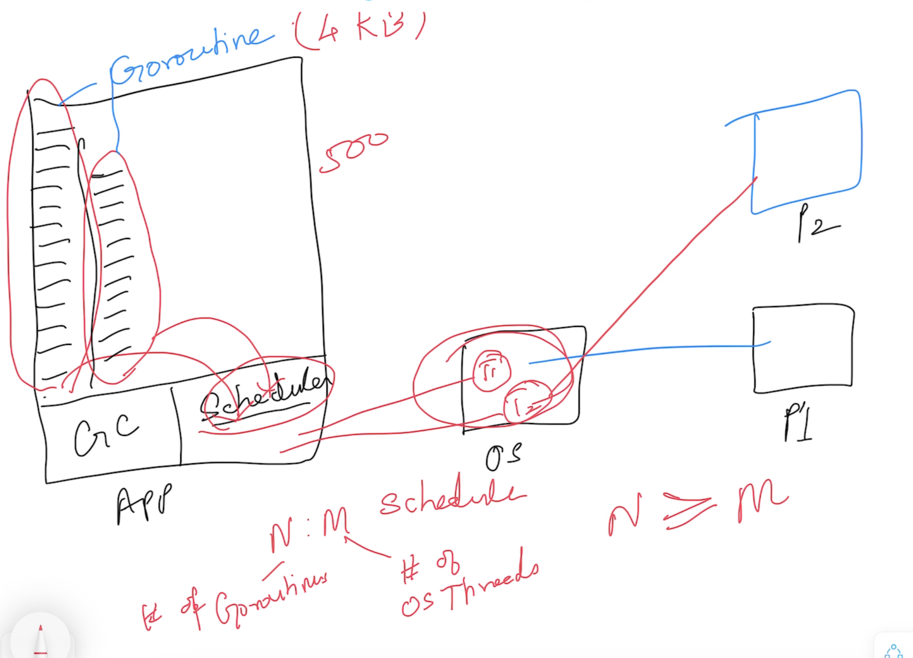
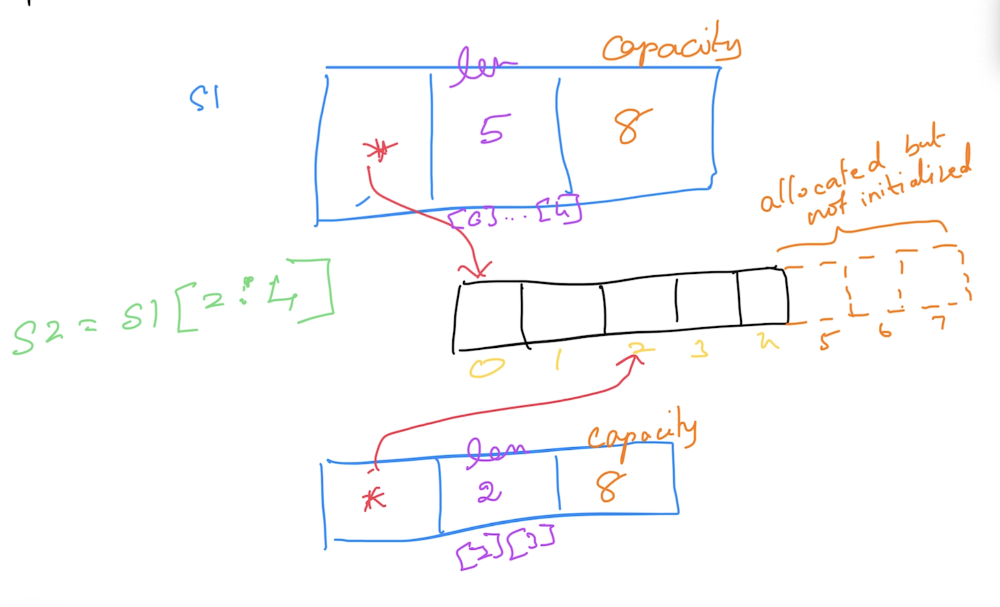

# Go Foundation

## Magesh Kuppan

## Schedule
- Commence      : 9:00 AM
- Tea Break     : 10:30 AM (20 mins)
- Lunch Break   : 12:30 PM (1 hr)
- Tea Break     : 3:00 PM (20 mins)
- Wind Up       : 5:00 PM

## Methodology
- No powerpoint presentation
- Discuss & Code
- No dedicated time for Q&A

## Repository
- https://github.com/tkmagesh/cisco-go-mar-2024

## Software Requirements
- Go Tools (https://go.dev/dl)
- Visual Studio Code (https://code.visualstudio.com)
- Go Extension for VS Code (https://marketplace.visualstudio.com/items?itemName=golang.Go)
    - Configuring Go Extension
        - cmd + shift + p
        - Go: install/update tools
        - Hit ENTER

### Verification
> go version

## Why Go?
- Simplicity
    - ONLY 25 keywords 
    - NO access modifiers (public / private etc)
    - NO reference types (everything is a "value" by default)
    - NO Pointer arithmatic
    - NO classes (only structs)
    - NO inheritance (only composition)
    - NO exceptions (only errors)
    - NO "try-catch-finally" constructs
    - NO implicit type conversion
    - Language Constructs
        - var, :=
        - if else, switch case
        - for
        - function
        - struct
        - interface
- Performance
    - Close to hardware (No JVM/CLR)
    - Build for each platform
        - Tooling support for cross-compilation
    - On par with c++
- Concurrency
    - Managed Concurrency (built in scheduler)
    - A concurrent operation is represented as a goroutine (lightweight - 4KB)
    - Language support for concurrency
        - go keyword, channel data type, channel operator ( <- ), for-range & select-case constructs
    - API support
        - sync package
        - sync/atomic package
    

## To execute a go file
> go run <file_name.go>
## To create a build
> go build <file_name.go>

> go build -o <binary_name> <file_name.go>
## To get the list of env variables used by go tool
> go env

> go env <var_1> <var_2>
## To set the values of env variables
> go env -w <var_1>=<val_1> <var_2>=<val_2> ....
## The environment variables for Cross compilation
- GOOS
- GOARCH
## To get the list of supported platforms (OS/processor)
> go tool dist list
## To cross compile
> GOOS=<target_os> GOARCH=<target_arch> go build  <file_name.go>

ex:
> GOOS=windows GOARCH=386 go build  01-hello-world.go

## Data Types
- bool
- string
- integer types
    - int8
    - int16
    - int32
    - int64
    - int
- unsigned integer types
    - uint8
    - uint16
    - uint32
    - uint64
    - uint
- float types
    - float32
    - float64
- complex types
    - complex64 (real[float32] + imaginary[float32])
    - complex128 (real[float64] + imaginary[float64])
- type aliases
    - byte (alias for uint8)
    - rune (alias for int32 / unicode code point)

## Variables in Go
- Function Scope
    - Can use "var" & ":="
    - CANNOT have unused variables
- Package Scope
    - CANNOT use ":="
    - CAN have unused variables

## Functions
- Variadic functions
- Higher Order Functions (functions as data)
    - Assign functions as values to variables
    - Pass functions as arguments to other functions
    - Return functions as return values from other functions

## Errors
- Errors are just values
- Errors are "returned" from functions and NOT THROWN
- Errors should be the last value in the list of return values from a function
- Errors are objects implementing "error" interface (best practice)
- Factory functions for creating an error
    - errors.New()
    - fmt.Errorf()

## Deferred Functions
- Functions whose execution is postponed until the current function execution is completed
- function execution is prefixed with "defer" keyword
- deferred functions are executed in the reverse order

## Panic & Recovery
### Panic
- A state of the application where the application execution cannot proceed further
- Use "panic()" function to create a panic
- The deferred function that are already scheduled will be executed
### Recovery
- The "recover()" returns the info that led to the panic

## Collections
- 3 collection types are natively supported
    - Array
    - Slice
    - Map
### Array
- Fixed sized collection of data of the same type
- The size of the array cannot be changed at runtime
- Memory is allocated and initialized (with default values) by default

### Slice
- Varying sized collection of data of the same type
- A slice maintains a pointer to an underlying array
- The size of the slice an be changed at runtime by adding new items
- append() -> to add new items to a slice
- len() -> # of elements that can be accessed through the slice from the underlying array
- cap() -> initialized + allocated memory

### Map
- Typed collection of key/value pairs
- delete() - to remove a key

## Modularity
### Modules
- any code that need to versioned together & deployed together
- typically it is a folder with go.mod file
- go.mod (manifest file)
    - name of the module
        - typically is the complete repo path
    - targetted go runtime version
    - dependencies

create a module
> go mod init <module_name>

to execute a module
> go run .

to build a module
> go build .

> go build -o <binary_name> .

to include a 3rd party module (downloaded to $GOPATH/pkg/mod/... folder)
> go get <module_name>

to update the go.mod file (with adding/removing the module references)
> go mod tidy

to download the modules documented in the go.mod file (dependencies)
> go mod download

to localize the dependencies 
> go mod vendor

other userful module commands
> go mod graph

> go mod why <module_name>

### Module command reference
    - https://go.dev/ref/mod

### Packages
- internal organization of a module
- typically folders with one or more .go files
